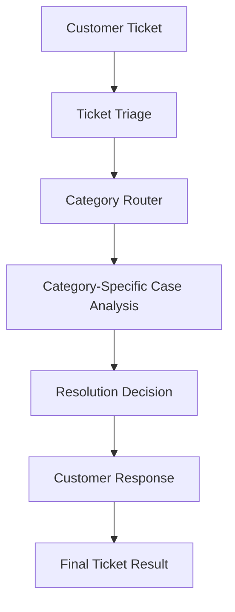

# AI Customer Support Automation

Automate customer-support ticket triage, category-specific analysis, resolution decisions, and response drafting with LangChain, Groq, and Streamlit.

[](https://www.python.org/)
[](https://streamlit.io/)
[](https://www.langchain.com/)
[](https://groq.com/)
[](https://docs.pydantic.dev/)
[](https://render.com/)

---

## Overview

Customer support teams often spend significant time reading tickets, classifying them, deciding next steps, and drafting replies. This project demonstrates an end-to-end **AI customer support automation** pipeline that:

1. Accepts a customer support ticket
2. Classifies it (category, priority, language)
3. Runs **category-specific** case analysis
4. Decides a resolution path and whether a human agent is needed
5. Generates a customer-facing response

The system is implemented as a modular LangChain workflow with **Pydantic structured outputs**, exposed through a **Streamlit** web UI and a batch CLI entry point.

---

## Demo

**[Live Demo](YOUR_RENDER_URL)** ← replace with your Render URL

> Placeholder: update this link once the Render service URL is available.

---

## Key Features

- Customer support ticket processing (web UI and batch JSON pipeline)
- Automatic ticket categorization
- Priority detection (`low`, `medium`, `high`, `critical`)
- Language detection from ticket text
- Category-specific case analysis (Billing, Technical, Account, Cancellation/Refund, Order/Delivery, General)
- Resolution decision (`self_service`, `resolve`, `escalate`, `request_information`)
- Human-escalation flag (`requires_human`)
- Recommended next action
- AI-generated customer response
- Pydantic schemas for structured LLM outputs
- Streamlit interface for interactive ticket processing
- Groq-powered LLM inference via LangChain (`langchain-groq`)

---

## Architecture



| Stage | Role |
| --- | --- |
| **Customer Ticket** | Input with `ticket_id`, `customer_name`, and ticket text (from Streamlit or `data/support_tickets.json`). |
| **Ticket Triage** | Classifies category, priority, and language using a structured Pydantic schema (`TicketTriage`). |
| **Category Router** | Routes the ticket to the matching analysis chain via LangChain `RunnableBranch`. |
| **Case Analysis** | Extracts category-specific fields (for example amount/refund for billing, error message for technical). |
| **Resolution Decision** | Chooses resolution type, recommended action, human-needed flag, and reason (`ResolutionDecision`). |
| **Customer Response** | Drafts a reply grounded in triage, analysis, and resolution outputs. |
| **Final Ticket Result** | Assembles a `TicketResult` object for display (Streamlit) or JSON export (CLI). |

---

## Supported Categories

| Category | Purpose |
| --- | --- |
| **Billing** | Charges, invoices, duplicate payments, refunds related to billing |
| **Technical** | Bugs, crashes, errors, outages, product malfunction |
| **Account** | Login, access, credentials, account status, verification |
| **Cancellation/Refund** | Plan cancellations and refund requests tied to cancel/retain decisions |
| **Order/Delivery** | Order status, shipping delays, wrong items, delivery issues |
| **General** | Plan questions and other requests that do not fit the categories above |

---

## Technology Stack

| Technology | Role in this project |
| --- | --- |
| **Python** | Core language (`.python-version` → `3.13`) |
| **Streamlit** | Interactive web application (`streamlit_app.py`) |
| **LangChain** | Prompt chains, routing, and pipeline orchestration |
| **LangChain Groq** | Groq chat model integration (`ChatGroq`) |
| **Groq** | LLM inference backend |
| **Pydantic** | Structured schemas for triage, analysis, resolution, and final results |
| **python-dotenv** | Local loading of `.env` variables |
| **Git / GitHub** | Version control and source hosting |
| **Render** | Cloud hosting for the Streamlit app |

---

## Project Structure

```text
Customer Support Bot/
├── app.py                      # Batch CLI: process tickets from JSON → save results
├── streamlit_app.py            # Streamlit web UI
├── requirements.txt            # pip dependencies
├── .python-version             # Python 3.13
├── .env.example                # Local env template (create your own .env)
├── .gitignore
├── README.md
├── src/
│   ├── __init__.py
│   ├── chains.py               # Triage, analysis, router, resolution, response chains
│   ├── llm.py                  # Groq LLM factory (GROQ_API_KEY / GROQ_MODEL)
│   ├── schemas.py              # Pydantic models
│   └── workflow.py             # End-to-end process_ticket pipeline
├── prompts/
│   ├── classification_prompt.txt
│   ├── case_analysis_prompt.txt
│   ├── resolution_prompt.txt
│   └── response_prompt.txt
└── data/
    ├── support_tickets.json    # Sample tickets for batch runs
    └── output/                 # Batch results written by app.py
```

---

## How It Works

1. **Input** — A ticket is submitted in Streamlit, or loaded from `data/support_tickets.json` via `python app.py`.
2. **LLM setup** — `create_llm()` reads `GROQ_API_KEY` and optional `GROQ_MODEL`, then builds a `ChatGroq` model.
3. **Workflow build** — `build_workflow()` creates triage, router, resolution, and response chains.
4. **Triage** — The classification prompt + `TicketTriage` schema produce category, priority, and language.
5. **Route & analyze** — The router selects a category-specific analysis schema and shared case-analysis prompt.
6. **Resolve** — The resolution prompt + `ResolutionDecision` schema produce next-step guidance.
7. **Respond** — The response chain drafts a customer reply using the structured context above.
8. **Output** — Streamlit shows metrics, case summary fields, resolution details, and the reply. The CLI saves a list of `TicketResult` objects to `data/output/support_ticket_results.json`.

---

## Installation

```bash
git clone https://github.com/AtifMazhar-01/customer-support-bot-langchain.git
cd customer-support-bot-langchain

python -m venv .venv
```

**Windows (PowerShell / CMD):**

```bash
.venv\Scripts\activate
```

**Linux / macOS:**

```bash
source .venv/bin/activate
```

Install dependencies with pip:

```bash
pip install -r requirements.txt
```

---

## Environment Variables

Create a local `.env` file in the project root (`.env` is gitignored):

```env
GROQ_API_KEY=your_groq_api_key
GROQ_MODEL=openai/gpt-oss-120b
```

| Variable | Required | Description |
| --- | --- | --- |
| `GROQ_API_KEY` | Yes | API key from [Groq Cloud](https://console.groq.com/) |
| `GROQ_MODEL` | No | Model name; defaults to `openai/gpt-oss-120b` if unset |

Never commit real API keys.

---

## Running Locally

### Streamlit web app

```bash
streamlit run streamlit_app.py
```

Open the local URL shown in the terminal, enter a customer name and ticket text, then click **Process Ticket**.

### Batch CLI (optional)

Process all tickets in `data/support_tickets.json` and write results to `data/output/support_ticket_results.json`:

```bash
python app.py
```

---

## Deployment

This project is deployed as a **Streamlit** web service on **Render**.

Suggested Render settings:

| Setting | Value |
| --- | --- |
| **Repository** | Connect this GitHub repo |
| **Build command** | `pip install -r requirements.txt` |
| **Start command** | `streamlit run streamlit_app.py --server.port $PORT --server.address 0.0.0.0` |
| **Environment variables** | `GROQ_API_KEY`, `GROQ_MODEL` |

Add the Groq variables in the Render dashboard (Environment). Do not store secrets in the repository.

---

## Example

**Sample input** (from `data/support_tickets.json`):

> **Customer:** Rahul Sharma  
> **Ticket:** I was charged twice for my Premium subscription this month. The amount is $29.99 each time. Please refund one of the duplicate charges.

**Type of output the app produces** (fields from `TicketResult`; values vary by model run):

| Field | Example content type |
| --- | --- |
| `category` | e.g. `billing` |
| `priority` | e.g. `high` |
| `language` | e.g. `English` |
| `case_summary` | Structured JSON (issue, amount, transaction count, refund flag for billing) |
| `resolution_type` | One of `self_service`, `resolve`, `escalate`, `request_information` |
| `recommended_action` | Concrete next step for support |
| `requires_human` | `true` / `false` |
| `resolution_reason` | Why that resolution was chosen |
| `response` | Draft customer-facing reply |

The Streamlit UI surfaces these as analysis metrics, category-specific case fields, resolution details, and the generated response.

---

## Design / Engineering Highlights

- **Modular LangChain workflow** — Triage, routing, analysis, resolution, and response are separate chains composed in `workflow.py`.
- **Externalized prompts** — Prompt text lives in `prompts/`, so wording can change without editing chain code.
- **Pydantic structured outputs** — Schemas in `schemas.py` constrain LLM responses for reliable downstream use.
- **Category-specific analysis** — Shared analysis prompt with per-category focus fields and dedicated Pydantic models.
- **Clear separation of concerns** — `llm.py` (model), `chains.py` (runnables), `schemas.py` (contracts), `workflow.py` (orchestration), UI/CLI entry points.
- **Environment-based configuration** — Groq credentials and model name come from environment variables via `python-dotenv`.

---

## Limitations

Based on the current implementation:

- The Streamlit app processes **one ticket at a time**; it does not persist results to a database.
- Ticket history, search, and multi-turn conversation are **not** implemented.
- There is **no authentication** or role-based access control.
- Human escalation is a **decision flag** (`requires_human`), not an integrated agent handoff system.
- Classification, priority, and responses depend on the LLM; there is **no evaluation/test harness** in the repo.
- Batch output is file-based JSON only (`app.py` → `data/output/`).

---

## Future Improvements

> Planned ideas — **not** implemented today.

- Persistent ticket database
- User authentication
- Conversation / ticket history and search
- Analytics dashboard
- Real human-agent handoff integration
- Additional support categories
- Evaluation and testing framework for triage/resolution quality

---

## Author

**Atif Mazhar**

---

## License

No license file is currently included in this repository. Rights remain with the author unless a license is added later.
